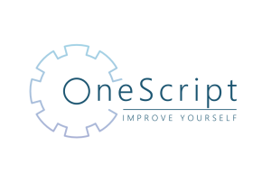

# OneScript #

[](https://t.me/oscript_library) [](https://build.oscript.io/job/1Script/job/develop/) [](https://build.oscript.io/job/1Script/job/master/)

## Проект является независимой кросс-платформенной реализацией виртуальной машины, исполняющей скрипты на языке 1С:Предприятие ##



При этом библиотеки системы 1С:Предприятие не используются и не требуется установка системы 1С:Предприятие на целевой машине.

Иными словами, это инструмент для написания и выполнения программ на языке 1С без использования платформы 1С:Предприятие.

## Название и произношение ##

Проект носит название OneScript, может быть сокращен при написании до названия 1Script. Произносится как `[уанскрипт]`.

OneScript позволяет создавать и выполнять текстовые сценарии, написанные на языке, знакомом любому специалисту по системе 1С:Предприятие. Применение знакомого языка для скриптовой автоматизации позволяет значительно повысить продуктивность специалиста за счет более простой автоматизации ручных операций.

## Сайт проекта ##

Основная информация о проекте, релизы и техдокументация расположены на официальном сайте

[https://oscript.io](https://oscript.io)

## Библиотека полезных скриптов ##

В поставку OneScript уже входит набор наиболее часто используемых пакетов. Эти, а также другие пакеты находятся в репозитории [oscript-library](https://github.com/oscript-library) и доступны всем желающим. Имеется пакетный менеджер [opm](https://github.com/oscript-library/opm).

## Установка ##

### Windows ###

- (интерактивно) скачать c [официального сайта](https://oscript.io) или установщик из раздела [Releases](https://github.com/EvilBeaver/OneScript/releases) и запустить его. Далее, Далее, Готово.

### Linux ###

- (интерактивно) скачать нужный пакет [официального сайта](https://oscript.io) или установщик из раздела [Releases](https://github.com/EvilBeaver/OneScript/releases) и установить его.

### MacOS ###

Интерактивного установщика нет, но движок можно установить из командной строки:

- установить [homebrew](https://brew.sh/index_ru)
- установить mono командой `brew install mono`
- скачать [ovm](https://github.com/oscript-library/ovm/releases)
- выполнить команду `mono ovm.exe install stable`
- выполнить команду `mono ovm.exe use stable`
- перезапустить терминал

#### Донастройка Self-Contained варианта поставки (не требующего инсталляции dotnet)

```
chmod +x ./oscript
xattr -d com.apple.quarantine *.dylib oscript
codesign -s - ./oscript
```


# Ручная локальная сборка

## Подготовка

Ниже приведены ссылки на дистрибутивы, однако, учтите, что ссылки могут меняться со временем и их актуальность не гарантируется. Нужен dotnet SDK и компилятор C++, скачать можно из любого места, которое нагуглится.

* Установить [MS BuildTools](https://visualstudio.microsoft.com/ru/thank-you-downloading-visual-studio/?sku=buildtools&rel=16), при установке включить таргетинг на .net6, .net4.8, установить компилятор C++.

## Сборка

Запустить Developer Command Prompt (появится в меню Пуск после установки MSBuildTools или Visual Studio). Перейти в каталог репозитория OneScript. Далее приведены команды в консоли Developer Command Prompt
Сборка выполняется с помощью msbuild. Таргеты:

* CleanAll - очистка результатов предыдущих сборок
* BuildAll - подготовить файлы для поставки
* MakeCPP;MakeFDD;MakeSCD;BuildDebugger - отдельные таргеты сборки для подготовки разных типов поставки
* PrepareDistributionFiles - сборка полных пакетов поставки (включая библиотеки)
* PackDistributions - подготовка ZIP архивов поставки
* CreateNuget - создать пакеты для публикации в NuGet

**Параметры сборки**

* VersionPrefix - префикс номера релиза, его основная часть, например, 2.0.0
* VersionSuffix - суффикс номера, который обычно выступает в качестве произвольного суффикса версионирования по semver, например, beta-786 (необязателен)
* NoCppCompiler - если True - не установлен компилятор C++, в сборку не будут добавлены компоненты C++ (поддержка NativeApi)

Все поставляемые файлы будут размещены в каталоге `built` в корне репозитория 1Script

### Сборка содержимого дистрибутивов в отдельном каталоге

```bat
msbuild Build.csproj /t:CleanAll;PrepareDistributionFiles
```

### Сборка с ручным указанием версии

```bat
msbuild Build.csproj /t:CleanAll;PrepareDistributionFiles /p:VersionPrefix=2.0.0
```

### Сборка ZIP-дистрибутивов

```bat
msbuild Build.csproj /t:CleanAll;PrepareDistributionFiles;PackDistributions /p:VersionPrefix=2.0.0 /p:VersionSuffix=preview223
```