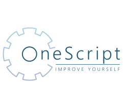

# OneScript #

[](https://t.me/oscript_library) [](https://build.oscript.io/job/1Script/job/develop/) [](https://build.oscript.io/job/1Script/job/master/)

## Проект является независимой кросс-платформенной реализацией виртуальной машины, исполняющей скрипты на языке 1С:Предприятие ##

 

При этом библиотеки системы 1С:Предприятие не используются и не требуется установка системы 1С:Предприятие на целевой машине.

Иными словами, это инструмент для написания и выполнения программ на языке 1С без использования платформы 1С:Предприятие.

## Название и произношение ##

Проект носит название OneScript, может быть сокращен при написании до названия 1Script. Произносится как `[уанскрипт]`.

OneScript позволяет создавать и выполнять текстовые сценарии, написанные на языке, знакомом любому специалисту по системе 1С:Предприятие. Применение знакомого языка для скриптовой автоматизации позволяет значительно повысить продуктивность специалиста за счет более простой автоматизации ручных операций.

## Сайт проекта ##

Основная информация о проекте, релизы и техдокументация расположены на официальном сайте

[https://oscript.io](https://oscript.io)

## Библиотека полезных скриптов ##

В поставку OneScript уже входит набор наиболее часто используемых пакетов. Эти, а также другие пакеты находятся в репозитории [oscript-library](https://github.com/oscript-library) и доступны всем желающим. Имеется пакетный менеджер [opm](https://github.com/oscript-library/opm).

## Установка ##

### Windows ###

- (интерактивно) скачать c [официального сайта](https://oscript.io) или установщик из раздела [Releases](https://github.com/EvilBeaver/OneScript/releases) и запустить его. Далее, Далее, Готово.

### Linux ###

#### v2.x (текущая ветка) — на базе .NET 8.0 ####

Существуют два варианта ZIP-архива:

| Вариант                       | Описание                         | Внешние зависимости                                                                 |
|-------------------------------|----------------------------------|-------------------------------------------------------------------------------------|
| **SCD** (self-contained)      | .NET Runtime уже включён в архив | Нет                                                                                 |
| **FDD** (framework-dependent) | Более компактный архив           | Требуется [.NET Runtime 8.0](https://learn.microsoft.com/dotnet/core/install/linux) |

Шаги установки:
- Скачать ZIP-архив для Linux со [страницы релизов](https://github.com/EvilBeaver/OneScript/releases) или с [официального сайта](https://oscript.io).
- Распаковать архив в удобный каталог.
- Установить права на выполнение:
  ```bash
  chmod +x oscript
  ```

Для FDD-варианта необходим .NET Runtime 8.0 — инструкция по установке на вашем дистрибутиве: [learn.microsoft.com/dotnet/core/install/linux](https://learn.microsoft.com/dotnet/core/install/linux).

#### v1.x LTS — deb-пакет (Mono) ####

LTS-ветка распространяется в виде `.deb`-пакета и работает на базе Mono. Пакет автоматически устанавливает минимально необходимые компоненты Mono, однако **для работы отладчика** требуется `mono-complete`.

> **Важно для отладки на Ubuntu/Debian:** если точки останова не срабатывают, установите `mono-complete` из **официального репозитория Mono Project** (не из репозиториев дистрибутива). Инструкция для вашей системы — на [сайте Mono Project](https://www.mono-project.com/download/stable/#download-lin).

### MacOS ###

- Скачать ZIP-архив для macOS (x64 или arm64) со [страницы релизов](https://github.com/EvilBeaver/OneScript/releases) или с [официального сайта](https://oscript.io).
- Распаковать архив в удобный каталог.
- Выполнить донастройку для снятия карантина и подписи:
  ```bash
  chmod +x ./oscript
  xattr -d com.apple.quarantine *.dylib oscript
  codesign -s - ./oscript
  ```


# Ручная локальная сборка

## Подготовка

Для сборки потребуется:

* [.NET SDK 8.0](https://dotnet.microsoft.com/download/dotnet/8.0) (целевой фреймворк проекта — `net8.0`).
* Компилятор C++ — нужен только для сборки нативного моста `ScriptEngine.NativeApi` (поддержка внешних компонент стандарта 1С NativeApi). На Windows проще всего получить его, поставив [MS Build Tools](https://visualstudio.microsoft.com/visual-studio-build-tools/) или Visual Studio с компонентом «Разработка классических приложений на C++». Если C++ компилятора нет, см. параметр `NoCppCompiler` ниже.

> Ссылки на дистрибутивы могут меняться со временем, их актуальность не гарантируется.

## Сборка

Сборка выполняется с помощью MSBuild и сценария `Build.csproj` в корне репозитория. Команды можно запускать как через `msbuild` (Developer Command Prompt после установки MS Build Tools/Visual Studio), так и через `dotnet msbuild` (кросс-платформенно).

Основные таргеты:

* `CleanAll` — очистка результатов предыдущих сборок;
* `BuildAll` — собрать бинарные файлы для поставки (FDD, SCD, отладчик; при наличии C++ — нативные компоненты);
* `MakeCPP`, `MakeFDD`, `MakeSCD`, `BuildDebugger` — отдельные таргеты сборки разных частей поставки;
* `GatherLibrary` — скачать и сложить базовый набор библиотек (`opm`, `asserts`, `logos`, `fs`, `tempfiles`, `cli`);
* `PrepareDistributionFiles` — собрать полные содержимые дистрибутивов (вкл. библиотеки и документацию);
* `PackDistributions` — упаковать содержимое в ZIP-архивы под все поддерживаемые платформы;
* `BuildDocumentation` — сгенерировать справку по платформе (markdown + json);
* `CreateNuget` / `PublishNuget` — собрать и опубликовать NuGet-пакеты;
* `Test` (`UnitTests`, `ScriptedTests`) — прогнать модульные и приёмочные (BSL) тесты.

**Параметры сборки**

* `VersionPrefix` — основная часть номера релиза, например `2.0.0` (по умолчанию `2.0.0`);
* `VersionSuffix` — необязательный suffix по SemVer, например `beta-786`;
* `NoCppCompiler` — если `True`, нативные компоненты C++ (NativeApi) не собираются и не включаются в дистрибутив (используйте, если компилятор C++ не установлен);
* `Configuration` — конфигурация сборки, по умолчанию `Release`. Для отладочной сборки на Linux используется `LinuxDebug`.

Все артефакты сборки размещаются в каталоге `built` в корне репозитория.

### Сборка содержимого дистрибутивов в отдельном каталоге

```bat
dotnet msbuild Build.csproj /t:CleanAll;PrepareDistributionFiles
```

### Сборка с ручным указанием версии

```bat
dotnet msbuild Build.csproj /t:CleanAll;PrepareDistributionFiles /p:VersionPrefix=2.0.0
```

### Сборка ZIP-дистрибутивов

```bat
dotnet msbuild Build.csproj /t:CleanAll;PrepareDistributionFiles;PackDistributions /p:VersionPrefix=2.0.0 /p:VersionSuffix=preview223
```

### Сборка без C++-компонент (без NativeApi)

```bat
dotnet msbuild Build.csproj /t:CleanAll;PrepareDistributionFiles /p:NoCppCompiler=True
```

### Генерация документации

```bat
dotnet msbuild Build.csproj /t:BuildDocumentation
```

# Тестирование

В проекте есть два уровня тестов:

* **Модульные тесты на C#** — расположены в `src/Tests/*` (xUnit/NUnit), запускаются через `dotnet test` в каталоге соответствующего тестового проекта или одной командой:
  ```bat
  dotnet msbuild Build.csproj /t:UnitTests
  ```
* **Приёмочные тесты на BSL** — расположены в каталоге `tests/` и запускаются через `testrunner.os` на свежесобранном `oscript`. Для удобства в репозитории есть скрипты-обёртки:
  ```bat
  rem Windows
  tests\run-bsl-tests.cmd src\oscript\bin\Debug\net8.0\oscript.exe
  ```

  ```bash
  # Linux/macOS
  tests/run-bsl-tests.sh src/oscript/bin/Debug/net8.0/oscript
  ```

  Перед запуском приёмочных тестов нужно собрать `oscript`:
  ```bat
  dotnet build src/oscript/oscript.csproj
  ```

# Документация для разработчиков

Если вы хотите контрибьютить в проект, познакомьтесь с дополнительными документами в каталоге [`docs/`](docs/):

* [`docs/developer_docs.md`](docs/developer_docs.md) — архитектура проекта, состав решения и навигация по исходному коду.
* [`docs/contexts.md`](docs/contexts.md) — практическое руководство по добавлению BSL-контекстов, методов, свойств и глобальных функций.
* [`CODESTYLE.md`](CODESTYLE.md) — требования к стилю кода на C#.
